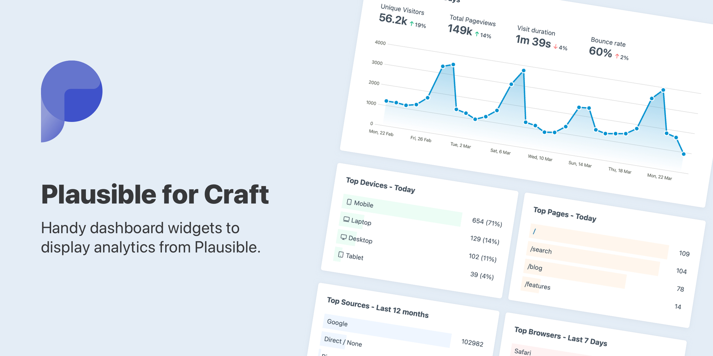

# Plausible plugin for Craft CMS 3.x

<!--  -->

Plausible is a Craft CMS plugin that gives you handy dashboard widgets to display analytics data from Plausible.

## Requirements

This plugin requires Craft CMS 3.0.0-beta.23 or later.

## Installation

To install the plugin, follow these instructions.

1. Open your terminal and go to your Craft project:

        cd /path/to/project

2. Then tell Composer to load the plugin:

        composer require shornuk/plausible

3. In the Control Panel, go to Settings → Plugins and click the “Install” button for Plausible.

## Configuring Plausible

You'll need to enter your Plausible API key, (can be generated within your account settings) and the Site ID you wish to display data for. This is usually just the domain, eg. domain.com

Brought to you by [Shorn](https://shorn.co.uk)
